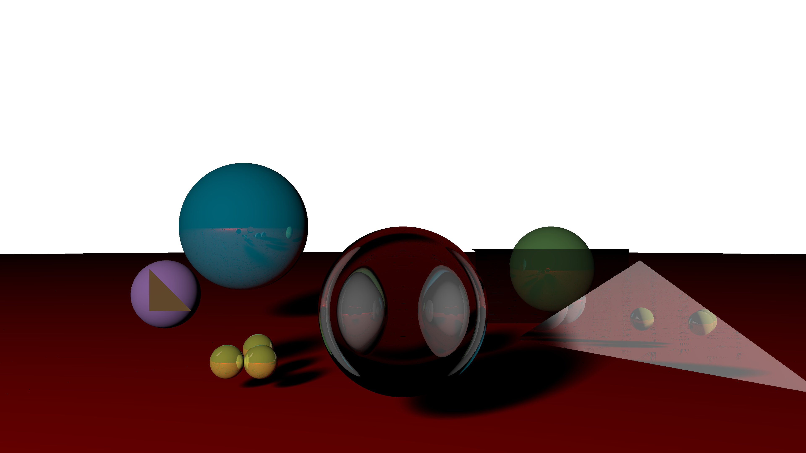
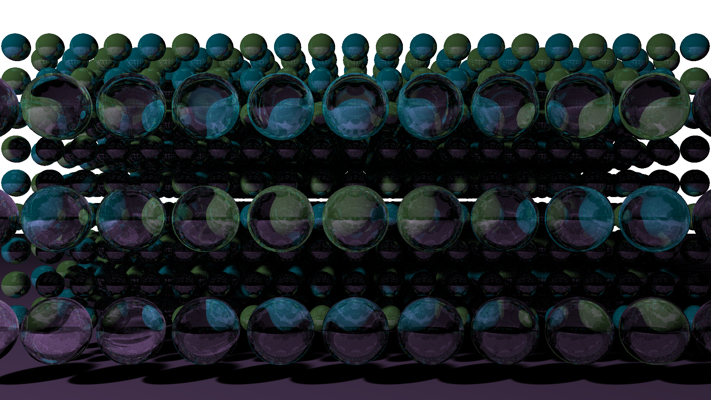

# An Optimized Ray Tracer

Developed by Nikhil Athreya and Andrew Ying in Visual Studio Code (Live Share)

## Summary
Ray tracing is appealing for its ability to create realistic lighting effects, but ray tracing can be slow, especially when compared to rasterization. In this project, we implemented a ray tracer from scratch, equipped it with an array of common features such as soft shadows, and optimized it. Our ray tracer outputs images in the PPM format for cross-platform compatibility and ease of use. 

### List of Features
With respect to materials/lighting, our ray tracer supports:

* hard and soft shadows;
* reflections and refractions;
* materials (transparent, diffuse).

With respect to optimization, our ray tracer utilizes: 

* CPU-based parallelization using OpenMP
* A bounding volume hierarchy data structure (BVH) using a Surface Area Heuristic

The Surface Area Heuristic answers the question “which partition is best for ray-primitive intersections?” To do this, the heuristic compares two costs:

1. the cost of intersecting the current region with a ray; and
2. the (total) cost resulting from splitting the region, intersecting the component regions with a ray (using surface area ratios to determine probabilities a ray will intersect both volumes), and summing those two costs.

Our BVH also supports debug mode (lines 31-55). We wrote a visualize method which is called when the debug flag is toggled. The visualize method traverses the BVH so the user can verify the integrity of the generated hierarchy. 

## Example Assets

This 4K image, rendered entirely by our raytracer (20 ray bounces), showcases some of its most impressive functionality.

Note that the center sphere looks like Spiderman because it is a transparent sphere in front of two reflective spheres.

How might we confirm this? The blue and green spheres are reflective, and if one zooms into them close enough, one can see the entire scene in its reflection(!) 

Finally, note the soft shadows casted on the floor, which were created by arranging point lights in a rectangular fashion to simulate area lights.

This scene contains almost 2000 balls! The inspiration behind this work was to battle test our optimizations. Using quad core (8 logical thread) Intel i7-7700HQ (with 16 GB of RAM) and a BVH, we were able to render this scene in under 15 minutes. Note that this image is 1920x1080. For comparison, when we rendered this scene to a 1000x800 image with no parallelization and no BVH, it took almost 1.5 hours! The spheres alternate between grass and topaz colors, and only the front array of spheres is nearly transparent. 

## Future Work
With more time, we would’ve liked to work on further optimizations (like SIMD processing mentioned by Prof. Kayvon). Additionally, we’d like to explore other image formats less inefficient than PPM. 

## Acknowledgements 
The authors thank the entirety of the CS248 teaching staff for a wonderful whirlwind tour of Interactive Computer Graphics. Their instruction and guidance greatly assisted the success of our project. Physically Based Rendering (Humphreys and Pharr) was additionally very helpful as a reference.  

